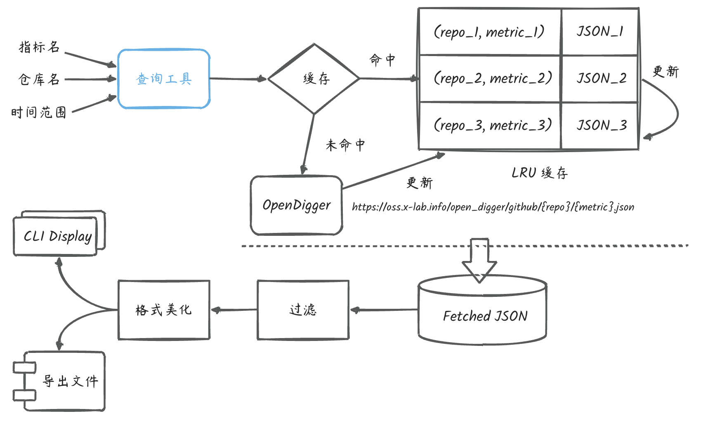

# 

本项目为 OpenSODA 大赛的 `T2：命令行交互的指标结果查询子模块` 的提交作品，该工具主要以 `Python` 实现，结果导出为 `.csv` 文件。

### 1. 工具设计


#### 输入
宏观上我们可以认为，工具的基本输入为 `指标名`，`仓库名` 以及 `时间范围`：
- `指标名`：若输入为 `all` 则查询目前 OpenDigger 支持的所有指标，因此实际上输入的指标应该为一个列表，可以为单一指标，也可以指定多个指标；
- `时间范围`：时间范围有三种：
  - 闭区间：例如 `[2022-02, 2022-06]`
  - 单时间点：例如 `2022-06`
  - 离散时间点：例如 `(2022-02, 2022-05, 2021-09)`


#### 输出
基本的输出为 `.csv` 文件，其以输入的三个指标作为表头，详细描述了此次查询的报表；





### 2. 使用说明

1. 首先安装本项目运行所需的依赖
```python
pip install -r requirements.txt
```
2. 运行 `main.py`：
```python
python main.py --month=2022-05
```
